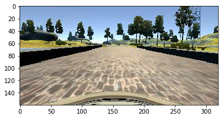
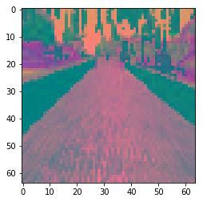

# SDCND Project 3: Behaviour Cloning

This project uses a convolutional neural network trained in Keras in order to train a car in a driving simulator to drive itself around a test track.

This project contains the following files:

* model.py : A python script used to train the neural network
* drive.py : A python script used to make predictions using the neural network and send the 
steering angle values to the simulator
* model.h5 : The neural network model weights
* model.json : The neural network model architecture


## Solution and Design Process

The purpose of this project is to use training image data taken from Udacity's Self Driving Car Simulator to train a neural network and to use its predictions to output steering angles that can be used by the car to drive itself in the simulator. Udacity provided 8036 images each for center, left, and right camera perspectives of the car in the simulator that were used to train this neural network. The data was preprocessed in order to yield better model accuracy. Data augmentation was also used to increase the amount of data that could be used to train the artificial neural network.

The neural network was created using Keras in order to simplify the design process. The training data was then fed into the compiled model in batches of 256 using a Keras fit_generator optimized over the data for five iterations. The model and its weights were saved so that they could be reused using the drive.py script to feed steering predictions into the simulator.

The model was iterated over multiple times until it yielded a successful run of the test track. The largest gains in the performance of the model were seen in the stages of data preprocessing and data augmentation and so most of the effort was expended to produce the best quality and quantity of image data for the model.


## Image Preprocessing

Data was first preprocessed using OpenCV. The images began as 160 by 320 pixels, had the top and bottom 40 pixels cropped, and were then resized to be 64 x 64 pixels. The crop was performed to remove noise from the image such as the sky, trees, and the car itself. The 64x64 resize was done to remove dimensionality from the data. The colours were then transformed from RGB to YUV since this yielded better performance than simply leaving the colours as RGB. A transform of a center image can be seen below. Since the data was able to fit into memory, a generator was not used to produce the augmented data.


```python
import matplotlib.pyplot as plt
import matplotlib.image as mpimg
import cv2
%matplotlib inline
img=mpimg.imread('data/IMG/center_2016_12_01_13_30_48_287.jpg')
plt.imshow(img)
```


    <matplotlib.image.AxesImage at 0x7f54840a91d0>





```python
def preprocess(img):
    img = img[40:120,:]
    img = cv2.resize(img,(64,64))
    img = cv2.cvtColor(img,cv2.COLOR_BGR2YCR_CB)
    return img
%matplotlib inline
plt.imshow(preprocess(img))
```


    <matplotlib.image.AxesImage at 0x7f5483fdd5f8>





## Data Augmentation and Splitting

Training data was augmented in two ways. The first was to incorporate both the left and right perspective images to increase the amount of data and to increase the number of data with larger steering angles. In order to use these images, a steering offset needed to be applied to the steering angle label so that they could be used as if they were center images. A steering offset value of 0.25 was found to be effective. The second form of augmentation was done by performing vertical reflections on the images and adding these to the dataset.

Since the majority of steering angles are very small, all steering angles less than 0.1 were randomly filtered using a normal distribution so that they would not be oversampled in training. The number of images was increased from 8,036 to 24, 225 images that were used in training.

Data was split into training and validation sets using SKLearn's train_test_split function with 80% of data being allocated to the training set and 20% being allocafted to the validation set. No test set was created since the model accuracy can be evaluated using the simulator instead.

## Model Architecture

The model architecture was based off of the NVIDIA model used in http://images.nvidia.com/content/tegra/automotive/images/2016/solutions/pdf/end-to-end-dl-using-px.pdf as it was shown to be effective for a very similar use-case.

The model begins with a BatchNormalization layer to normalize the data so that the model trains more effectively. Following this are three 5x5 convolutional layers each with 2x2 strides. There are then two three by three convolution layers with no stride. There is then a flatten layer following by three fully-connected layers. Finally, there is a tanh activation layer with a single node fully-connected layer that is used to provide the steering output. Tanh is used as it produces values within the range of -1 to 1 which are exactly what is desired for steering angles.

ELU activation layers are used after all convolution and fully-connected layers aside from the last. Dropout with a keep probability of 0.2 is used after each convolution and the flatten layer. It is also used for all fully-connected layers other than the last two. The code and a table of the model can be seen below.


```python
from sklearn.model_selection import train_test_split
from keras.models import Sequential
from keras.layers import Dense, Input, Activation
from keras.layers.convolutional import Conv2D
from keras.layers.normalization import BatchNormalization
from keras.layers.core import Flatten, Dropout


model = Sequential()
model.add(BatchNormalization(input_shape=(64,64,3)))

# three 5x5 convolution layers with 2x2 strides, ELU Activation
# and 0.2 dropout after each convolution layer
model.add(Conv2D(24, 5, 5,subsample=(2,2), dim_ordering='tf'))
model.add(Activation('elu'))
model.add(Dropout(0.2))
model.add(Conv2D(36, 5, 5,subsample=(2,2) ,dim_ordering='tf'))
model.add(Dropout(0.2))
model.add(Activation('elu'))
model.add(Conv2D(48, 5, 5,subsample=(2,2), dim_ordering='tf'))
model.add(Activation('elu'))
model.add(Dropout(0.2))

# two 3x3 convolution layers with no stride, ELU activation,
# and 0.2 dropout after each convolution layer
model.add(Conv2D(64, 3, 3, dim_ordering='tf'))
model.add(Activation('elu'))
model.add(Dropout(0.2))
model.add(Conv2D(64, 3, 3, dim_ordering='tf'))
model.add(Activation('elu'))

# flatten layer followed by 0.2 dropout
model.add(Flatten())
model.add(Dropout(0.2))

# three fully connected layers with 100, 50, and 10 nodes respectively,
# ELU activation, and 0.2 dropout after each layer other than the last two.
model.add(Dense(100))
model.add(Activation('elu'))
model.add(Dropout(0.2))
model.add(Dense(50))
model.add(Activation('elu'))
model.add(Dropout(0.2))
model.add(Dense(10))
# tanh activation followed by a single node to be used as the steering input
model.add(Activation('tanh'))
model.add(Dense(1))
model.summary()
```

    ____________________________________________________________________________________________________
    Layer (type)                     Output Shape          Param #     Connected to                     
    ====================================================================================================
    batchnormalization_2 (BatchNorma (None, 64, 64, 3)     12          batchnormalization_input_2[0][0] 
    ____________________________________________________________________________________________________
    convolution2d_6 (Convolution2D)  (None, 30, 30, 24)    1824        batchnormalization_2[0][0]       
    ____________________________________________________________________________________________________
    activation_9 (Activation)        (None, 30, 30, 24)    0           convolution2d_6[0][0]            
    ____________________________________________________________________________________________________
    dropout_8 (Dropout)              (None, 30, 30, 24)    0           activation_9[0][0]               
    ____________________________________________________________________________________________________
    convolution2d_7 (Convolution2D)  (None, 13, 13, 36)    21636       dropout_8[0][0]                  
    ____________________________________________________________________________________________________
    dropout_9 (Dropout)              (None, 13, 13, 36)    0           convolution2d_7[0][0]            
    ____________________________________________________________________________________________________
    activation_10 (Activation)       (None, 13, 13, 36)    0           dropout_9[0][0]                  
    ____________________________________________________________________________________________________
    convolution2d_8 (Convolution2D)  (None, 5, 5, 48)      43248       activation_10[0][0]              
    ____________________________________________________________________________________________________
    activation_11 (Activation)       (None, 5, 5, 48)      0           convolution2d_8[0][0]            
    ____________________________________________________________________________________________________
    dropout_10 (Dropout)             (None, 5, 5, 48)      0           activation_11[0][0]              
    ____________________________________________________________________________________________________
    convolution2d_9 (Convolution2D)  (None, 3, 3, 64)      27712       dropout_10[0][0]                 
    ____________________________________________________________________________________________________
    activation_12 (Activation)       (None, 3, 3, 64)      0           convolution2d_9[0][0]            
    ____________________________________________________________________________________________________
    dropout_11 (Dropout)             (None, 3, 3, 64)      0           activation_12[0][0]              
    ____________________________________________________________________________________________________
    convolution2d_10 (Convolution2D) (None, 1, 1, 64)      36928       dropout_11[0][0]                 
    ____________________________________________________________________________________________________
    activation_13 (Activation)       (None, 1, 1, 64)      0           convolution2d_10[0][0]           
    ____________________________________________________________________________________________________
    flatten_2 (Flatten)              (None, 64)            0           activation_13[0][0]              
    ____________________________________________________________________________________________________
    dropout_12 (Dropout)             (None, 64)            0           flatten_2[0][0]                  
    ____________________________________________________________________________________________________
    dense_5 (Dense)                  (None, 100)           6500        dropout_12[0][0]                 
    ____________________________________________________________________________________________________
    activation_14 (Activation)       (None, 100)           0           dense_5[0][0]                    
    ____________________________________________________________________________________________________
    dropout_13 (Dropout)             (None, 100)           0           activation_14[0][0]              
    ____________________________________________________________________________________________________
    dense_6 (Dense)                  (None, 50)            5050        dropout_13[0][0]                 
    ____________________________________________________________________________________________________
    activation_15 (Activation)       (None, 50)            0           dense_6[0][0]                    
    ____________________________________________________________________________________________________
    dropout_14 (Dropout)             (None, 50)            0           activation_15[0][0]              
    ____________________________________________________________________________________________________
    dense_7 (Dense)                  (None, 10)            510         dropout_14[0][0]                 
    ____________________________________________________________________________________________________
    activation_16 (Activation)       (None, 10)            0           dense_7[0][0]                    
    ____________________________________________________________________________________________________
    dense_8 (Dense)                  (None, 1)             11          activation_16[0][0]              
    ====================================================================================================
    Total params: 143,431
    Trainable params: 143,425
    Non-trainable params: 6
    ____________________________________________________________________________________________________


## Model Training

The model was trained using an Adam optimizer to minimize the mean squared error across the validation data. The model was set to train for up to 1000 epochs with early stopping once the validation loss was not improved for two consecutive epochs. This was done so that the model would not overfit or underfit to the training data. Only the model that achieved the best validation loss in training was saved and used for the simulation. A batch size of 256 was used to increase the speed of the training. The model ran for 16 epochs before stopping early after no improvement to the validation loss.

## Reflection

Using the above methodology, the model was successfully able to drive the car around the track. The model is not perfect however and currently favours larger steering angles over smaller ones resulting in jerky behaviour. This could be improved through further optimization of the model and improved sampling of the training data. The model also fails to complete the untrained track successfully though it is able to navigate through the majority of it. Challenges on this track could be due to the changes in elevation of this track or the increased speed that is used in the simulator for this track. Responses to both could be improved through either increasing the number of training samples, or augmenting the data to account for these factors. 


